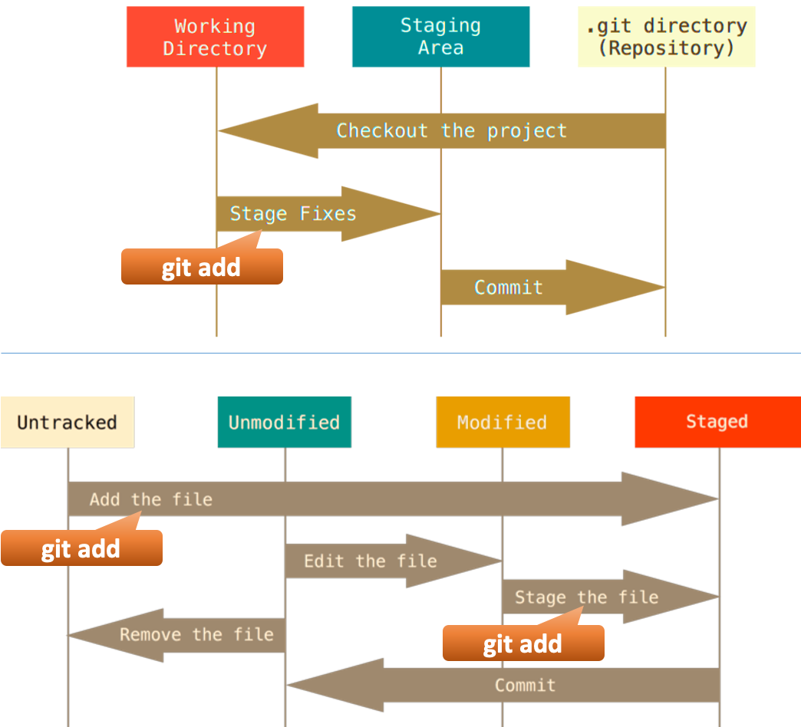

# Git-Tutorial

## Tìm hiểu Git ở Local pc
- Cài đặt Git và check version
```
Git --version
```
- Setup Git 
Setup Git để bắt đầu sử dụng
```
git config --global user.name "user-name"
git config --global user.email "your-email"
```
## Làm việc vs Git ở Local( Local Repository)
### Commit
- Khởi tạo thư mục thành 1 Repository
```
git init
```
- Kiểm tra trạng thái của các file trong Repo
```
git status
```
- Các trạng thái của các file

- Tiến hành theo dõi 1 file mới hoặc chuyển 1 file từ modified -> staged (chuẩn bị commit)
```
git add <file>
```
hoặc toàn bộ
```
git add .
```
- Tiến hành commit( Lưu 1 commit vào csdl)
```
git commit -m "Message"
```
- Kiểm tra xem branch hiện tại có những commit nào
```
git log
```
hoặc
```
git log --oneline
```
- Khôi phục các file trở về commit gần nhất( có thể dùng restore hoặc checkout)
```
git restore <file>
```
hoặc toàn bộ
```
git restore .
```
- Git checkout: khôi phục về 1 commit nào đó
```
git checkout <IdCommit> -- <file>
```
hoặc toàn bộ
```
git checkout <IdCommit> -- .
```
- Commit đè lên commit gần nhất
```
git commit --amend -m "Message"
```
### Xóa commit
- Xóa commit cuối( đảm bảo commit chưa push lên remote repo) và đẩy các file vừa lưu ở commit về vùng staging
```
git reset --soft HEAD~1
```
- Xóa hẳn commit cuối( đảm bảo commit chưa push lên remote repo) và các file vừa lưu ở commit cũng bị xóa 
```
git reset --hard HEAD~1
```
### Branch trong Git (Local)
- Tạo 1 branch mới (branch mới sẽ kế thừa tất cả các commit của branch cũ, commit tại thời điểm tạo branch mới sẽ là điểm giao giữa 2 branch)
```
git branch <name of branch>
```
- Chuyển đổi giữa các nhánh
```
git switch/checkout <branch_name>
```
#### Merge branch
- Đảm bảo 2 branch sắp merge vs nhau đều working tree clean
- Ở đây branch chính là A branch sửa lỗi hoặc thêm chức năng là B -> Khi tiến hành merge thì phải đứng ở branch A
- Lúc merge git sẽ tiến hành merge giữa commit cuối của branch A và commit cuối của branch B so sánh xem có conflic nào k
- Tiến hành merge
```
git merge <branchB_name>
```
- Nếu merge thành công k có conflic thì các commits của branch B sẽ đc branch A kế thừa còn branch B thì vẫn như cũ
- Nếu k cần nữa có thể xóa branch B
```
git branch -d <branchB_name>
```
#### Xử lý conflic khi merge branch
- Nếu 2 branch đều sửa đổi 1 file thì sẽ xảy ra conflic
- Nếu muốn hủy merge branch
```
git merge --abort
```
- Nếu vẫn muốn merge thì tiến hành xử lý: truy cập vào file conflic chọn lấy code ở branch A hay B sau đó tiến hành tạo ra 1 commit mới (commit đó chính là điểm giao của 2 branch)
- Xem chi tiết branch
```
git log --oneline --graph
```
#### Merge branch với rebase
- Khác với git merge: git rebase sẽ gộp 2 branch bằng cách lấy các commit của branch A làm các commit cơ sở và thêm các commit của branch B vào đầu  branch A, thay vì sắp xếp các branch theo thời gian
```
git rebase <branchB_name>
```
